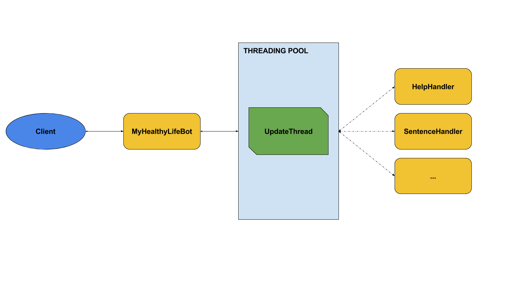

# MyHealthyLifeBot Application (client)

This is the telegram bot for MyHealthyLife project and it is hosted in heroku domains. As for the other clients it has the duty to retrieve, view, create and update all the information related to a user and the community.
The bot is capable of handling most of the requests available in centric01 and centric02. However, the remaining ones were not integrated because of their complexity.

In order to interact with MyHealthyLifeBot, the user needs to press the following link and start a new chat from the telegram client: http://t.me/myhealthylife_bot.

## 1. Features

##### Automatic retrievement of the sentences

The bot is provided with some timer tasks in order to retrieve every once in a while some motivational sentences for the user.
In particular, the bot sends motivational sentences based on the data inserted by the user.
This functionality works just like the one provided by the web application, but instead of having a manual retrievement of the sentence in this case the bot calls the centric service every three hours to have one.
Furthermore, the bot is implemented so to send to each user the dedicated sentences other users sent. As for the motivational sentences, the dedicated ones work just like the ones in the web application.

##### Commands

The main objective of the bot application is to remain simple to use.
Every command is an inline command that is present in the suggested list of the bot.
In particular, the commands present in the bot application are the following:
- **/register &lt;name&gt; &lt;surname&gt; &lt;birthdate&gt;:** register to the service
- **/name &lt;new name&gt;:** updates your name
- **/surname &lt;new surname&gt;:** updates your surname
- **/birthdate &lt;YYYY-MM-DD&gt;:** updates your birthdate
- **/unregister:** Deletes your user and all your data in the system
- **/healthstate:** visualize your current health state
- **/measure_history:** visualize the history of you measures
- **/addmeasure &lt;type&gt; &lt;value&gt;:** save a new measure
- **/randomsentence:** Get a random sentence to motivate the user
- **/sentenceforme:** Get a specific sentence based on your measures
- **/foodsforme:** Gets specific type of foods based on your health state
- **/goal:** Gets the goals you should reach
- **/ranking:** Gets a compact ranking with the neareast users around your position
- **/send &lt;destination user&gt; &lt;type&gt; &lt;trend (gain or loss)&gt;:** Sends a sentence to a destination user
- **/receive:** Receive all the sentences the other users dedicated to you within 7 days
- **/recipe &lt;recipe name&gt;:** Shows the details of an existing recipe
- **/recipesforme:** Gets specific recipes based on your measures
- **/start_notifications:** Starts the push notification service for your user
- **/unsubscribe_notification:** Stops the push notification service for your user
- **/weather:** get weather forecast

Since the main objective of the application was to be adaptable to different kind of devices, bootstrap components were used in order to construct pages with responsive layouts.
In particular, those pages are also integrated inside the android application that comes with the clients pack.

## 2. Application implementation
##### Multi-threading

In order to avoid requests queue saturation and to increase the performance this bot has been implemented with Multi-thread model. During the start-up a pool with 5 thread will be initialized. This permits the bot to send multiple requests at the same time. Also, if an user perform a request which request a lot of time to be handled, this does not block the other users' requests.

This model accelerates the requests processing and gives full support also to telegram groups where the bot has been added.

The following image shows how it has been implemented the thread model:

When a user send a request to the bot, first the *MyHealthyLifeBot* class intercept the request and then it passes the task to one of the threads in the pool. The thread reads the message and then selects the target handler which computes the response message. Finally the thread sends the response to the user.